# Maternal Mental Health Risk Factors

## About this repository

The Policy Center for Maternal Mental Health invites members of the public to clone this repository and construct the database on a local machine, and to use the data for strategic planning, fund-raising, policy implementation, or to increase public awareness.

The repository is distributed under 'CC BY-SA 4.0'.  Users are free to copy and redistribute the material in any medium or format, to remix, transform, and build upon the material for any purpose, even commercially, subject to the following terms:

### Attribution

 You must give appropriate credit to The Policy Center for Maternal Mental Health, provide a link to the license, and indicate if changes were made. You may do so in any reasonable manner, but not in any way that suggests the Policy Center endorses you or your use. 

### ShareAlike

If you remix, transform, or build upon the material, you must distribute your contributions under the same license as the original. 

## Contents
- [Overview](#overview)
- [Supporting Research](#supporting-research)
- [Database Tables and Scoring Queries](#database-tables-and-queries)
- [Care Coverage](#care-coverage)\
&emsp;- [The Provider Shortage Gap](#the-provider-shortage-gap)\
&emsp;&emsp;&emsp;[Estimated Number of Births](#estimated-number-of-births)\
&emsp;&emsp;&emsp;[Required Number of Providers](#required-number-of-providers)\
&emsp;&emsp;&emsp;[The Gap](#the-gap)
- [Geography](#geography)
- [Risk Factors](#risk-factors)\
&emsp;- [Tier I (18 pts max)](#tier-i-18-pts-max)\
&emsp;&emsp;&emsp;[Lifetime Prevalence of Psychological Aggression by an Intimate Partner](#1)\
&emsp;&emsp;&emsp;[Violent Crime](#2)\
&emsp;&emsp;&emsp;[Poor Mental Health Days](#3)\
&emsp;&emsp;&emsp;[Mother lacks emotional support](#4)\
&emsp;&emsp;&emsp;[Pregnancy: Mistimed, Unwanted, Unsure whether Wanted, Intended](#5)\
&emsp;&emsp;&emsp;[Children in poverty](#6)\
&emsp;- [Tier II (12 pts max)](#tier-ii-12-pts-max)\
&emsp;&emsp;&emsp;[Educational Attainment by Fertility Status (gave birth within last 12 months)](#7)\
&emsp;&emsp;&emsp;[Children in single parent households](#8)\
&emsp;&emsp;&emsp;[Employment Status of Parents by Household presence and age of Children](#9)\
&emsp;&emsp;&emsp;[Teen births](#10)\
&emsp;&emsp;&emsp;[Cesarean Delivery Rate](#11)\
&emsp;&emsp;&emsp;[Preterm birth rates](#12)\
&emsp;- [Tier III (7 pts max)](#tier-iii-7-pts-max)\
&emsp;&emsp;&emsp;[Mental Healthcare Providers](#13)\
&emsp;&emsp;&emsp;[Income Inequality](#14)\
&emsp;&emsp;&emsp;[Reproductive Age, % white](#15)\
&emsp;&emsp;&emsp;[Reproductive Age, % Hispanic](#16)\
&emsp;&emsp;&emsp;[Lack of insurance coverage](#17)\
&emsp;&emsp;&emsp;[Severe housing problems](#18)\
&emsp;&emsp;&emsp;[Food insecurity](#19)\
&emsp;- [Direct Measures of Need (8 pts max)](#direct-measures-of-need-8-pts-max)\
&emsp;&emsp;&emsp;[Poor mental health among mothers](#20)\
&emsp;&emsp;&emsp;[Mothers not coping well with raising their child](#21)\
&emsp;&emsp;&emsp;[Births and birth rates for reproductive age women](#22)
- [Contributors](#contributors)
- [References](#references)

## Overview

The Risk Factors Scores for Maternal Mental Health are derived by an algorithm incorporating:

- 19 factors that are shown to be associated with a greater risk of perinatal mental health disorders, and

- 3 factors which represent direct measures of need.

US regions with compounded maternal mental health risk factors may be in greater need of high-quality, person-centered maternal mental health support.

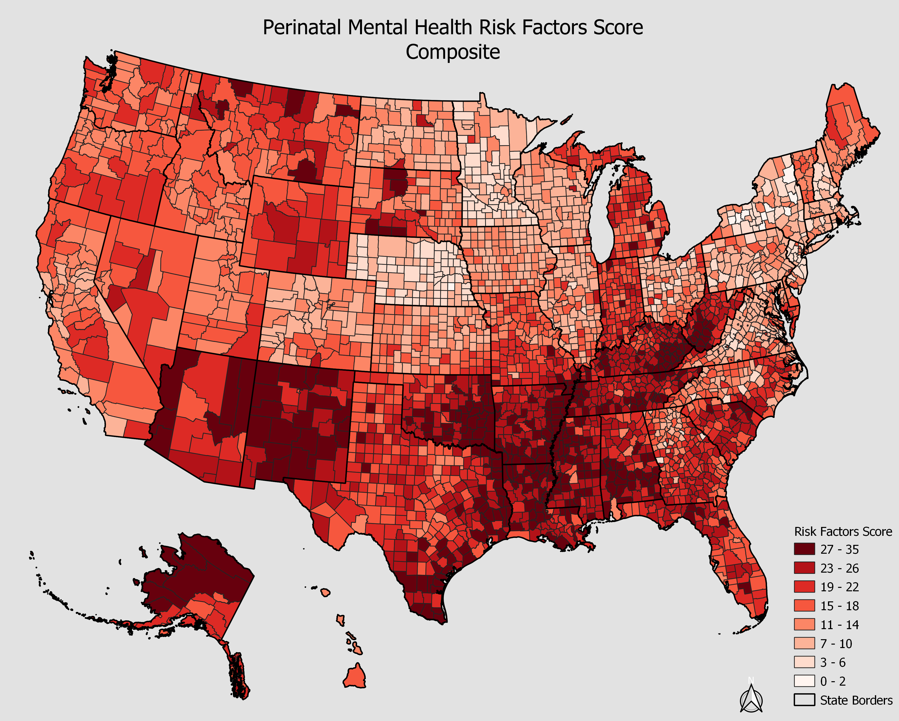

## Supporting Research

The Policy Center for Maternal Mental Health conducted an extensive
review of research studies examining the risk factors associated with
poor maternal mental health. This review identified 22 factors that: 1)
have been shown to be associated with a greater risk of maternal mental
health disorders, **and** 2) are currently measured via population-based
surveys.

Key research studies supporting each maternal mental health risk factor
are linked below. Please note that the risk factors with more supporting
research are considered "Tier I" or "Tier 2" factors.

***Tier I: Risk factors that have been associated with poor maternal
mental health in multiple systematic reviews.***

-   [I-1](#1) Intimate Partner Psychological Aggression [^1] [^2] [^3]

-   [I-2](#2) Violent Crime Rate [^4] [^5]

-   [I-3](#3) Poor Prenatal Mental Health [^6] [^7]

-   [I-4](#4) Mother Lacks Emotional Support [^8] [^9]

-   [I-5](#5) Unintended Pregnancy [^10] [^11] [^12]

-   [I-6](#6) Poverty Among Households with Children [^13] [^14]

***Tier II: Risk factors that have a known association with poor
maternal mental health, but with less supporting research.***

-   [II-7](#7) Educational Attainment [^15]

-   [II-8](#8) Single Mother [^16]

-   [II-9](#9) Household with at Least One Unemployed Parent [^17]

-   [II-10](#10) Teen Births [^18]

-   [II-11](#11) C-Section Rates [^19]

-   [II-12](#12) Preterm Birth Rates [^20]

***Tier III: Environmental stressors and hazards that are well known,
but for which research substantiating a direct link to poor maternal
mental health is currently absent.***

-   [III-13](#13) Mental Health Provider Rate

-   [III-14](#14) Income Inequality

-   [III-15](#15) % Women of Reproductive Age who are White

-   [III-16](#16) % Women of Reproductive Age who are Hispanic

-   [III-17](#17) Lack of Insurance Coverage

-   [III-18](#18) Severe Housing Problems

-   [III-19](#19) Food Insecurity

***Director Measures of Maternal Mental Healthcare:***

-   [DMN-20](#20) Poor Mental Health Among Mothers

-   [DMN-21](#21) Mothers Not Coping Well with Raising Child

-   [DMN-22](#22) Fertility Rates for Women of Reproductive Age

## Database Tables and Scoring Queries

The folder [pgSQL/](pgSQL) contains the SQL files necessary to construct and populate the database from the CSV records contained in [csv/](csv).

Various database clients may be able to run the SQL files located in [pgSQL/](pgSQL), however the mmh-risk-factors database was constructed with PostgreSQL. For best performance, PostgreSQL 13 or higher is recommended.

### Installing PostgreSQL

Download PostgreSQL [here](https://www.postgresql.org/download/) and follow the installation instructions for your operating system.  PostgreSQL ships with the psql client interface built-in.

### Base Tables

The file [pgSQL/base-tables.sql](pgSQL/base-tables.sql) defines the primary tables for all county level risk factors and loads each table from CSV. All data definitions can be found in the [Risk Factors](#risk-factors) section below.  To run the file and produce the primary tables, <code>cd</code> to the root directory [mmh-risk-factors/](/mmh-risk-factors/) and open the psql client, then run the file:

<pre>
$ psql -U username -d dbname
$ \i pgSQL/risk-factors.sql
</pre>

### Summary Tables

The file [pgSQL/prfs-summaries.sql](pgSQL/prfs-summaries.sql) defines the summary tables for each county level risk factor, consisting of the raw data along with the score allocation, and a determination of the quartile ranking of the county score within the national dataset.

To answer questions about particular risk factors, use the summary tables; for example:
<pre>
$ select * from i_2_prfs limit 5;
 FIPS  |  STATE  | COUNTY  | AAVC | VCR | QRT1 | QRT2 | QRT3 | QRT4 | I_2 | QRT
-------+---------+---------+------+-----+------+------+------+------+-----+-----
 01001 | Alabama | Autauga |  149 | 272 |  118 |  205 |  335 | 1820 |   2 |   3
 01003 | Alabama | Baldwin |  408 | 204 |  118 |  205 |  335 | 1820 |   0 |   2
 01005 | Alabama | Barbour |  106 | 414 |  118 |  205 |  335 | 1820 |   3 |   4
 01007 | Alabama | Bibb    |   20 |  89 |  118 |  205 |  335 | 1820 |   0 |   1
 01009 | Alabama | Blount  |  279 | 483 |  118 |  205 |  335 | 1820 |   3 |   4
(5 rows)
</pre>
Data definitions are available in the section [Risk Factors](#risk-factors) below.

### Scoring

All of the factor data and scoring are consolidated in the file [pgSQL/prfs-scores.sql](pgSQL/prfs-scores.sql), which exports the final table to CSV at [csv/prfs_scores.csv](csv/prfs_counties.csv)

# Care Coverage

The Policy Center for Maternal Mental Healthcare has developed a private database of Certified Perinatal Mental Healthcare Providers and Reproductive Psychiatrists engaged in maternal mental healthcare.

The total numbers  of 'Providers' and 'Prescribers' are aggregated at county and states levels in the following CSV's:

[csv/pmh_provider_counties.csv](csv/pmh_provider_counties.csv)

[csv/pmh_provider_states.csv](csv/pmh_provider_states.csv)

[csv/reprx_psych_states.csv](csv/reprx_psych_states.csv)

[csv/reprx_psych_counties.csv](csv/reprx_psych_counties.csv)

The SQL tables corresponding to the CSV's above are defined in [pgSQL/care-coverage.sql](pgSQL/care-coverage.sql) and can be loaded via psql as follows:

<pre>$ psql -U username -d dbname</pre>

<pre>$ \i pgSQL/care-coverage.sql</pre>

## Care Coverage Summary CSV

The [care-coverage.sql](care-coverage.sql) file produces a summary table: 

Table:&emsp;&emsp;&emsp;&emsp;<a name="1"/>[care_coverage](csv/care-coverage.csv)\
Source:&emsp;&emsp;&emsp;&nbsp;(2021) ACS 5-year Population Estimates;\
&emsp;&emsp;&emsp;&emsp;&emsp;&emsp;&nbsp;&nbsp;(2021) Centers for Disease Control and Prevention (CDC), National Center for Health\
&emsp;&emsp;&emsp;&emsp;&emsp;&emsp;&nbsp;&nbsp;Statistics, State Reports 2010-2012\
Description:&emsp;&nbsp;Summary of Fertility and MMH Provider Coverage

<pre>
    "FIPS"          Federal Information Processing System Code
    "COUNTY"        Name of County
    "STATE"         Name of state
    "STABRV"        State Abreviation
    "PROVIDERS"     (#) Certified PMH Providers
    "PRESCRIBERS"   (#) Licensed Prescribers
    "TOTPOP"        Population, total
    "FEMPOP"        Female Population, total
    "RPRAFEM"       (#) Female aged 15-44 years
    "FERTRATE"      Applicable Fertility Rate
    "BIRTHS_EST"    Estimate of Annual Births
    "RATIO"         (#) Certified PMH Providers per 1k Annual Births
    "REQPROV"       (#) Required Certified PMH Providers
    "COVERAGE"      (%) "PROVIDERS" / "REQPROV"
    "GAP"           (#) "REQPROV" - "PROVIDERS"
</pre>

## The Provider Shortage Gap

The Centers for Disease Control and Prevention National Center for Health Statistics estimates that over 3.6 million[^21] births took place in the U.S. in 2022. The Policy Center sought to develop a benchmark ratio consisting of the number of MMH providers divided by the number of births.  The goal is to have enough providers in each county so that the aggregate number of required treatment hours for all potential patients is satisfied.

The Policy Center makes a few simple assumptions in deriving the required number of providers in each county and state, based on the birth rate.
    <ul>
        <li>20% of birthing persons will require maternal mental healthcare treatment.</li>
        <li>Birthing persons in need of maternal mental healthcare will require, on average, 30 hours of treatment.</li>
        <li>A typical MMH provider is able to provide approximately 1200 total treatment hours annually.</li>
    </ul>

### Estimated Number of Births

The number of births per county is estimated by applying the 2021 CDC estimated fertility rate (see: [DMN_22](#22)) to the 2021 American Community Survey 5-year estimates of the reproductive age female population.  For counties with less than 100,000 total population, the fertility rate for 'Unidentified Counties' in each county's state is applied.

The 2021 ACS 5-year data was accessed via the U.S. Census Bureau API, using a private key.  The dataset can be downloaded via the shell script [census-api.sh](census-api.sh) and saved in [JSON](/mmh-risk-factors/json/rpr_age_fem_pop.json) and [CSV](/mmh-risk-factors/csv/rpr_age_fem_pop.csv) formats. NOTE: The Census Bureau API requires users to use a personal authentication key. [Request A Key](https://api.census.gov/data/key_signup.html)

For example, in Nevada County (CA), we estimate an annual birthrate of approximately 939, based on an estimated reproductive-aged female population of 15,089 and the applicable fertility rate (62.25), expressed in births per thousand population.

<pre>
$ select "FIPS","COUNTY","STATE","RPRAFEM","FERTRATE","BIRTHS_EST" from care_coverage where "COUNTY"='Nevada County' AND "STATE"='California';

 FIPS  |    COUNTY     |   STATE    | RPRAFEM | FERTRATE | BIRTHS_EST
-------+---------------+------------+---------+----------+------------
 06057 | Nevada County | California |   15089 |    62.25 |        939
(1 row)
</pre>

### Required Number of Providers

The required number of MMH providers per county depends on the estimated birth rate.  Given the assumptions we made above about the level of care required and the percentage of perinatal cases in need of care, we can impute the required number of providers by the following formulaOk:

"REQPROV" = "BIRTHS_EST" x 20% x 30 / 1200

### The Gap

The difference between the actual present number of providers and the required number of providers results in the 'gap', or the Provider Shortage Gap.

In Nevada County (CA), 939 estimated births requires approximately 5 certified MMH providers; the actual total of 3 providers leaves a Provider Shortage Gap of 2.

<pre>
$ select "FIPS","COUNTY","STATE","RPRAFEM","FERTRATE","BIRTHS_EST","PROVIDERS","REQPROV","GAP" from care_coverage where "COUNTY"='Nevada County' AND "STATE"='California';

 FIPS  |    COUNTY     |   STATE    | RPRAFEM | FERTRATE | BIRTHS_EST | PROVIDERS | REQPROV | GAP
-------+---------------+------------+---------+----------+------------+-----------+---------+-----
 06057 | Nevada County | California |   15089 |    62.25 |        939 |         3 |       5 |   2
(1 row)
</pre>

## Geography

The study area consists of 3,143 second level political divisions, including every county, parish, borough, and county-equivalent municipality within the 51 first level divisions which comprise the 50 states and the federal district.

A large contingent of the data is sourced from the County Health Rankings published by the University of Wisconsin Population Health Institute. The CHR data does not include data for the five populated U.S. territories, therefore those divisions have been omitted from the scoring and analysis.

The CHR and CDC data includes Valdez-Cordova census area (FIPS: 02261), an unorganized borough of Alaska that was abolished in 2019 and replaced by the census areas of Chugach (FIPS: 02063) and Copper River (FIPS: 02066). Data from Valdez-Cordova was applied to Chugach and Copper River for each risk factor component that uses CHR data.

Data from the CDC on Cesarean section deliveries includes Wade Hampton census area (AK FIPS:02270), which in 2015 was renamed Kusilvak census area (AK FIPS:02158); the data was adjusted accordingly.

Data from the CDC on Cesarean section deliveries includes Shannon County (SD FIPS:02270), which in 2015 was renamed Oglala County (SD FIPS:02158); the data was adjusted accordingly.

# Risk Factors

The maternal mental health risk factors are divided into three tiers, using a scale which allocates:\
&emsp;&emsp;up to (3) points per Tier I qualifier,\
&emsp;&emsp;up to (2) points per Tier II qualifier, and\
&emsp;&emsp;up to (1) point per Tier III qualifier.\
Additionally, there are several Direct Measures of Need, which are allocated up to (3) points per qualifier.\
The Maximum Point Total is 45.

### Tier I (18 pts max)
Factor:&emsp;&emsp;&emsp;&emsp;&nbsp;<a name="1"/>[I-1](csv/I-1.csv)\
Source:&emsp;&emsp;&emsp;&emsp;(2017) National Intimate Partner and Sexual Violence Survey,\
&emsp;&emsp;&emsp;&emsp;&emsp;&emsp;&emsp;&nbsp;State Reports 2010-2012\
Description:&emsp;&emsp;Lifetime Prevalence of Psychological Aggression by an Intimate Partner; State Level\
Key Variable:&emsp;&ensp;&nbsp;(%) Intimate-Partner Victimization of Any Kind\
Points:&emsp;&emsp;&emsp;&emsp;&nbsp;Highest Quartile within U.S: 2pts; Second-Highest Quartile: 1pt

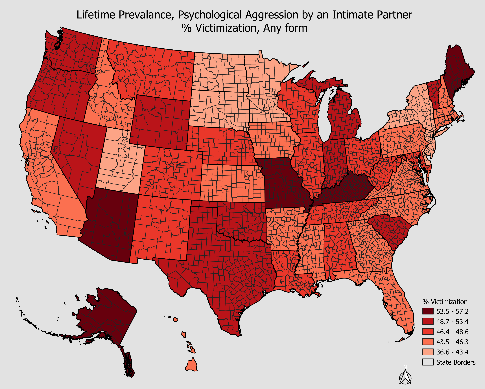
<pre>
    "STATE"         Name of state

    ***Any Psychological Aggression***
    "APPCT"         Weighted (%), Victimization
    "AP95PCTCILB"   Lower Bound, 95% C.I.
    "AP95PCTCIUB"   Upper Bound, 95% C.I.
    "APESTNV"       Estimated (#) Victims

    ***Any Expressive Aggression***
    "EVPCT"         Weighted (%), Victimization
    "EV95PCTCILB"   Lower Bound, 95% C.I.
    "EV95PCTCIUB"   Upper Bound, 95% C.I.
    "EVESTNV"       Estimated (#) Victims

    ***Any Coercive Control***
    "CCPCT"         Weighted (%), Victimization
    "CC95PCTCILB"   Lower Bound, 95% C.I.
    "CC95PCTCIUB"   Upper Bound, 95% C.I.
    "CCESTNV"       Estimated (#) Victims
</pre>

Factor:&emsp;&emsp;&emsp;&emsp;&nbsp;<a name="2"/>[I-2](csv/I-2.csv)\
Source:&emsp;&emsp;&emsp;&emsp;(2022) County Health Rankings & Roadmaps, University of Wisconsin Population Health Institute\
Description:&emsp;&emsp;Violent Crime\
Key Variable:&emsp;&ensp;&nbsp;Violent Crime Rate: (#) violent crimes reported per 100,000 population; County Level\
Points:&emsp;&emsp;&emsp;&emsp;&nbsp;Highest Quartile within US: 2pts; Second-Highest Quartile: 1pt\

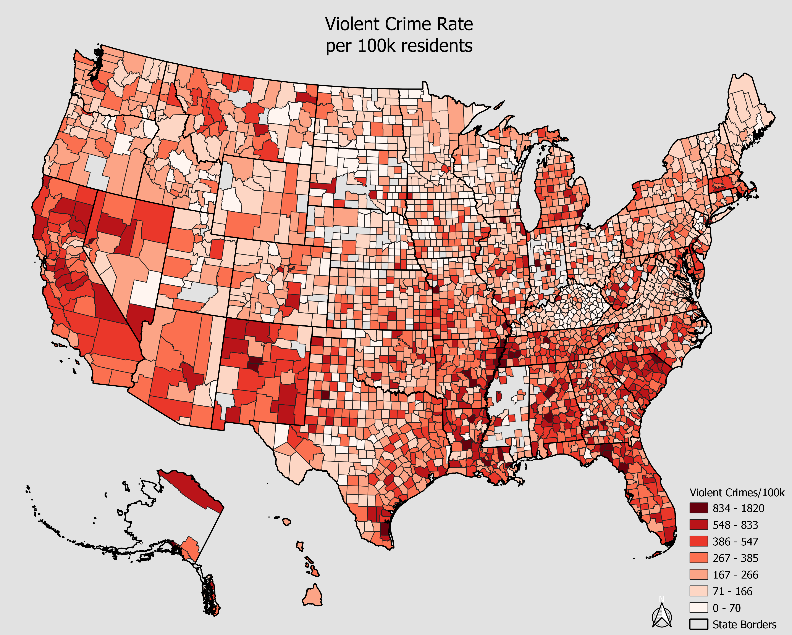
<pre>
    "FIPS"          Federal Information Processing System Code
    "STATE"         Name of State
    "COUNTY"        Name of County
    "AAVC"          Average Annual Violent Crimes
    "VCR"           Violent Crime Rate: (#) violent crimes reported per 100,000 population
    "VCRQRT"        County Quartile within State
</pre>

Factor:&emsp;&emsp;&emsp;&emsp;&nbsp;<a name="3"/>[I-3](csv/I-3.csv)\
Source:&emsp;&emsp;&emsp;&emsp;(2022) County Health Rankings & Roadmaps, University of Wisconsin Population Health Institute\
Description:&emsp;&emsp;Poor Mental Health Days; County Level\
Key Variable:&emsp;&ensp;&nbsp;Average (#) Mentally Unhealthy Days per Month\
Points:&emsp;&emsp;&emsp;&emsp;&nbsp;Highest Quartile within US:3pts; Second-Highest Quartile:2pts

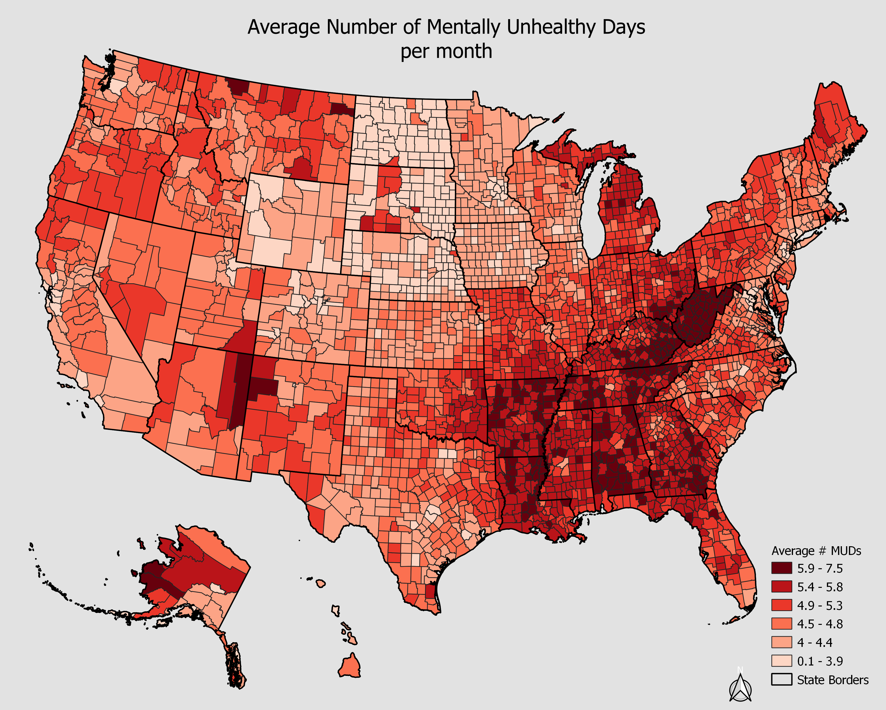
<pre>
    "FIPS"          Federal Information Processing System Code
    "STATE"         Name of State
    "COUNTY"        Name of County
    "AVNMUD"        Average (#) Mentally Unhealthy Days per Month
    "AVNMUD95CILB"  Lower Bound, 95% C.I.
    "AVNMUD95CIUB"  Upper Bound, 95% C.I.
    "AVMUDQRT"      County Quartile within State
</pre>

Factor:&emsp;&emsp;&emsp;&emsp;&nbsp;<a name="4"/>[I-4](csv/I-4.csv)\
Source:&emsp;&emsp;&emsp;&emsp;(2020-2021) National Survey of Children’s Health,\
&emsp;&emsp;&emsp;&emsp;&emsp;&emsp;&emsp;&nbsp;Health Resources and Services Administration, Maternal and Child Health Bureau\
Description:&emsp;&emsp;Mother lacks emotional support; State Level\
Key Variable:&emsp;&ensp;&nbsp;(%) Answering 'Yes'\
Points:&emsp;&emsp;&emsp;&emsp;&nbsp;Highest Quartile within U.S: 3pts; Second-Highest Quartile: 2pts

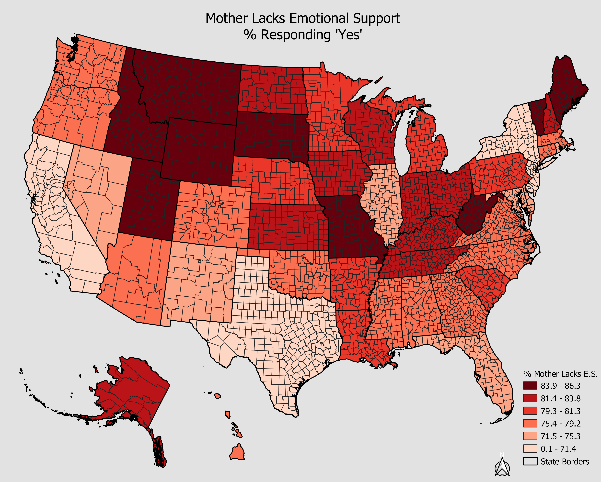
<pre>
Indicator 6.15: During the past 12 months, was there someone that you could turn to for
                day-to-day emotional support with parenting or raising children?
    "STATE"         Name of State
    "YESPCT"        (%) Answering 'Yes'
    "NOPCT"         (%) Answering 'No'
    "TOTALPCT"      (%) Total
</pre>

Factor:&emsp;&emsp;&emsp;&emsp;&nbsp;<a name="5"/>[I-5](csv/I-5.csv)\
Source:&emsp;&emsp;&emsp;&emsp;(2016-2020) Centers for Disease Control and Prevention (CDC)\
&emsp;&emsp;&emsp;&emsp;&emsp;&emsp;&emsp; Pregnancy Risk Assessment Monitoring System (PRAMS)\
Description:&emsp;&emsp;Pregnancy: Mistimed, Unwanted, Unsure whether Wanted, Intended; State Level\
Key Variable:&emsp;&ensp;&nbsp;(%) Pregnancies: Intended\
Points:&emsp;&emsp;&emsp;&emsp;&nbsp;Lowest Quartile within US: 3pts; Second-Lowest Quartile: 2pts

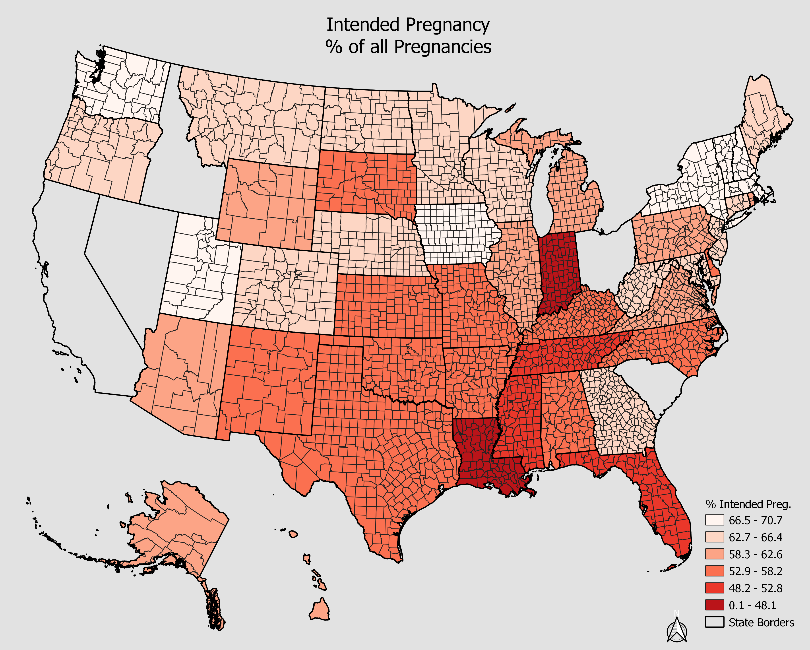
<pre>
    "STATE"         Name of State
    "YEAR"          Year of Survey
    "HLTHIND"       Health Indicator: Mistimed, Unwanted, Unsure whether wanted, Intended 
    "N"             Sample Size
    "PCT"           (%)
    "PCT95CILB"     Lower Bound, 95% C.I.
    "PCT95CIUB"     Upper Bound, 95% C.I.
</pre>

Factor:&emsp;&emsp;&emsp;&emsp;&nbsp;<a name="6"/>[I-6](csv/I-6.csv)\
Source:&emsp;&emsp;&emsp;&emsp;(2022) County Health Rankings & Roadmaps,\
&emsp;&emsp;&emsp;&emsp;&emsp;&emsp;&emsp;&nbsp;University of Wisconsin Population Health Institute\
Description:&emsp;&emsp;Children in poverty; County Level\
Key Variable:&emsp;&ensp;&nbsp;(%) (all children)\
Points:&emsp;&emsp;&emsp;&emsp;&nbsp;Highest Quartile within US: 3pts; Second-Highest Quartile: 2pts

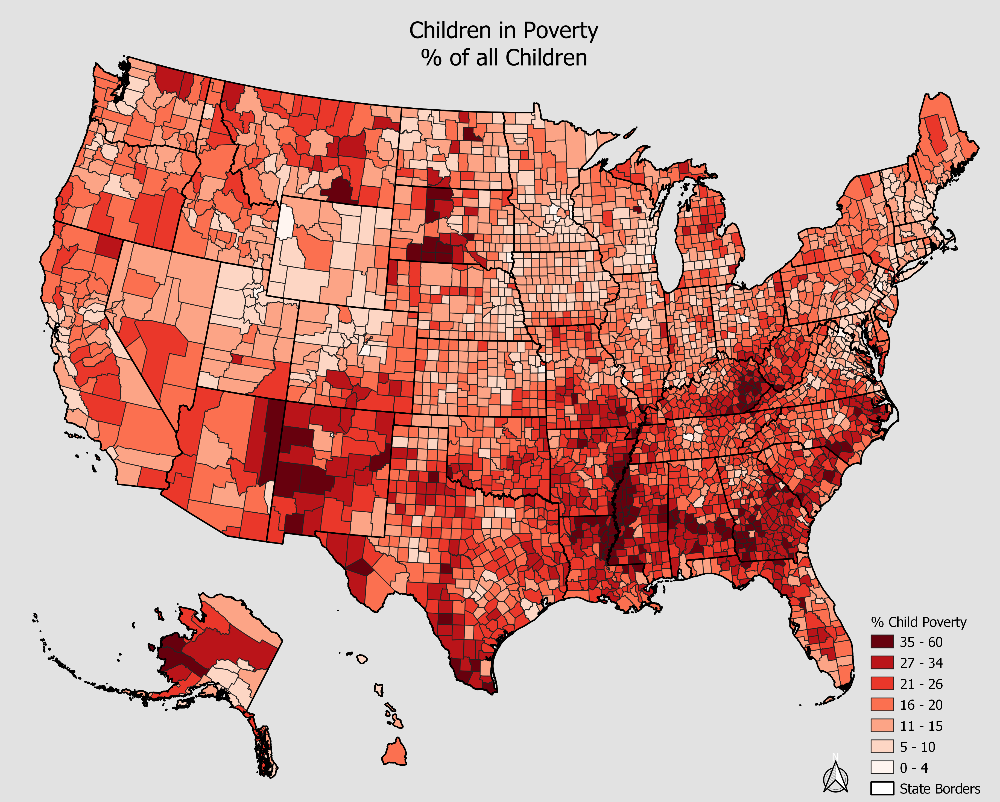
<pre>
    "FIPS"          Federal Information Processing System Code
    "STATE"         Name of State
    "COUNTY"        Name of County
    "CIPPCT"        (%) (all children)
    "CIP95CILB"     Lower Bound, 95% C.I. (all children)
    "CIP95CIUB"     Upper Bound, 95% C.I. (all children)
    "CIPQRT"        County Quartile within State (all children)
    "CIPPCTAIAN"    (%) (American Indian and Alaska Native)
    "CIPPCTASIAN"   (%) (Asian)
    "CIPPCTBLACK"   (%) (Black)
    "CIPPCTHSP"     (%) (Hispanic)
    "CIPPCTWH"      (%) (white)
</pre>

### Tier II (12 pts max)
Factor:&emsp;&emsp;&emsp;&emsp;&nbsp;<a name="7"/>[II-7](csv/II-7.csv)\
Source:&emsp;&emsp;&emsp;&emsp;(2020)ACS 5-Year Estimates Public Use Microdata Sample\
Description:&emsp;&emsp;Educational Attainment by Fertility Status (gave birth last 12 mo); State Level\
Key Variable:&emsp;&ensp;&nbsp;Below College Degree, Gave birth to child within past 12 months=Yes\
Points:&emsp;&emsp;&emsp;&emsp;&nbsp;Highest Quartile within US: 2pts; Second-Highest Quartile: 1pt

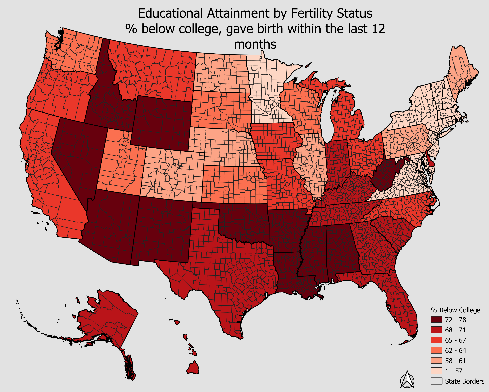
<pre>
    "STATEFP"       Federal Information Processing System Code
    "FER"           Gave birth to child within the past 12 months:
                        0=n/a
                        1=yes
                        2=no
    "EA0"           N/A (less than 3 years old)
    "EA1"           No schooling completed
    "EA2"           Nursery school, preschool
    "EA3"           Kindergarten
    "EA4"           Grade 1
    "EA5"           Grade 2 
    "EA6"           Grade 3
    "EA7"           Grade 4
    "EA8"           Grade 5
    "EA9"           Grade 6
    "EA10"          Grade 7
    "EA11"          Grade 8
    "EA12"          Grade 9
    "EA13"          Grade 10
    "EA14"          Grade 11
    "EA15"          12th grade - no diploma
    "EA16"          Regular high school diploma
    "EA17"          GED or alternative credential
    "EA18"          Some college, but less than 1 year
    "EA19"          1 or more years of college credit, no degree
    "EA20"          Associate's degree
    "EA21"          Bachelor's degree
    "EA22"          Master's degree
    "EA23"          Professional degree beyond a bachelor's degree
    "EA24"          Doctorate degree
</pre>

Factor:&emsp;&emsp;&emsp;&emsp;&nbsp;<a name="8"/>[II-8](csv/II-8.csv)\
Source:&emsp;&emsp;&emsp;&emsp;(2022) County Health Rankings & Roadmaps, University of Wisconsin Population Health Institute\
Description:&emsp;&emsp;Children in single parent households; County Level\
Key Variable:&emsp;&ensp;&nbsp;(%) of Children in Single-Parent Households\
Points:&emsp;&emsp;&emsp;&emsp;&nbsp;Highest Quartile within state: 2pts; Second-Highest Quartile: 1pt

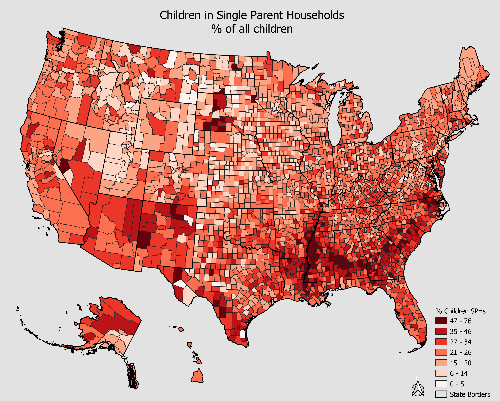
<pre>
    "FIPS"          Federal Information Processing System Code
    "STATE"         Name of State
    "COUNTY"        Name of County
    "NCHSPHH"       (#) of Children in Single-Parent Households
    "NCHHH"         (#) of Children in Households
    "PCTCHSPHH"     (%) of Children in Single-Parent Households
    "PCT95CILB"     Lower Bound, 95% C.I.
    "PCT95CIUB"     Upper Bound, 95% C.I.
    "PCTQRT"        County Quartile within State
</pre>

Factor:&emsp;&emsp;&emsp;&emsp;&nbsp;<a name="9"/>[II-9](csv/II-9.csv)\
Source:&emsp;&emsp;&emsp;&emsp;(2020)ACS 5-Year Estimates Public Use Microdata Sample\
Description:&emsp;&emsp;Employment Status of Parents by Household presence and age of Children; State Level\
Key Variable:&emsp;&ensp;&nbsp;At least one parent unemployed, HHs with children\
Points:&emsp;&emsp;&emsp;&emsp;&nbsp;Highest Quartile within US: 2pts; Second-Highest Quartile: 1pt

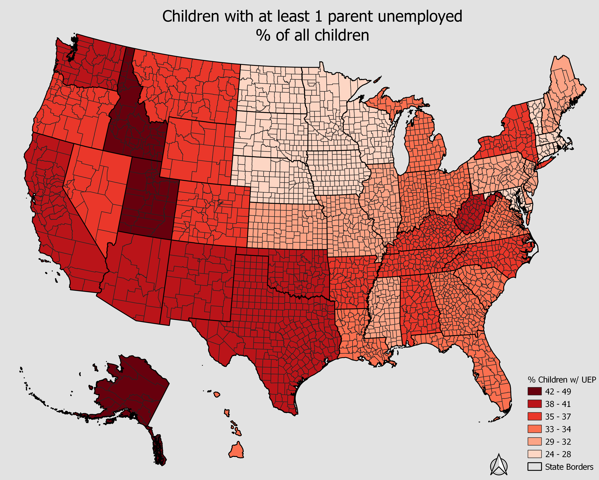
<pre>
    "STATEFP"       Federal Information Processing System Code
    "HUPAC"         HH presence and age of children:
                        0=n/a (GQ/vacant)
                        1=With children less than 6 years only
                        2=With children 6 to 17 years only
                        3=With children under 6 years and 6 to 17 years
                        4=No children
    "ESP0"          N/A (not own child of householder, and not child in subfamily)
    "ESP1"          Living with two parents: Both parents in labor force
    "ESP2"          Living with two parents: Father only in labor force
    "ESP3"          Living with two parents: Mother only in labor force
    "ESP4"          Living with two parents: Neither parent in labor force
    "ESP5"          Living with father: Father in labor force
    "ESP6"          Living with father: Father not in labor force
    "ESP7"          Living with mother: Mother in labor force
    "ESP8"          Living with mother: Mother not in labor force
</pre>

Factor:&emsp;&emsp;&emsp;&emsp;&nbsp;<a name="10"/>[II-10](csv/II-10.csv)\
Source:&emsp;&emsp;&emsp;&emsp;(2022) County Health Rankings & Roadmaps, University of Wisconsin Population Health Institute\
Description:&emsp;&emsp;Teen births; County Level\
Key Variable:&emsp;&ensp;&nbsp;(#) of births per 1,000 female population ages 15-19\
Points:&emsp;&emsp;&emsp;&emsp;&nbsp;Highest Quartile within US: 2pts; Second-Highest Quartile: 1pt

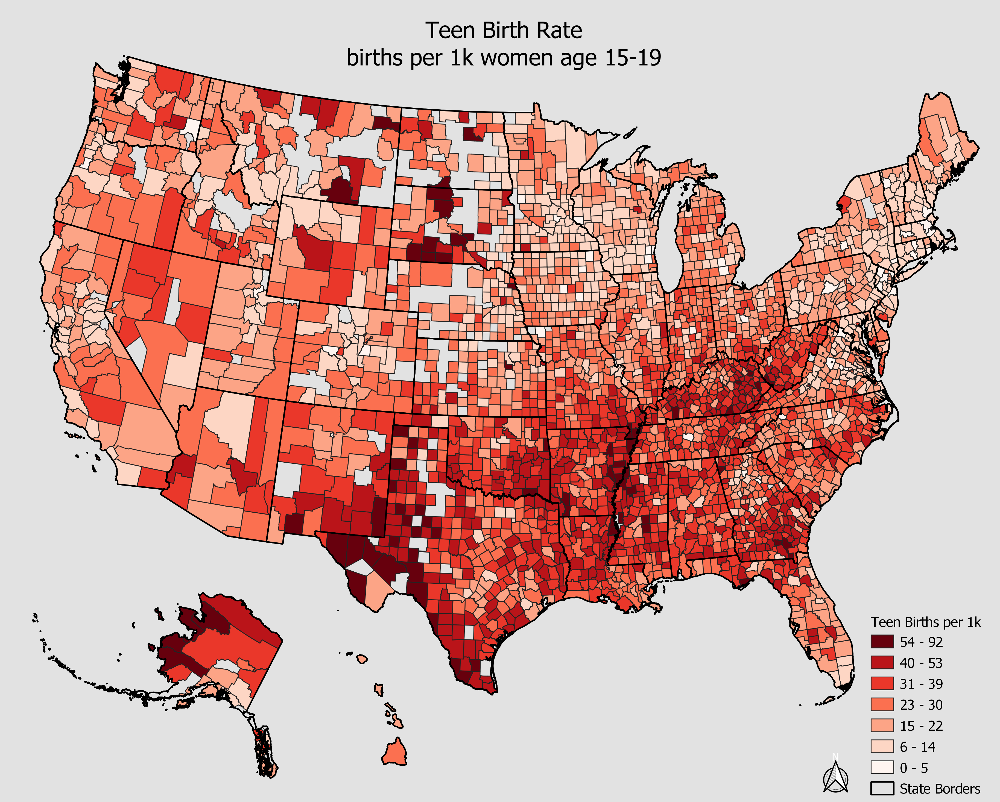
<pre>
    "FIPS"          Federal Information Processing System Code
    "STATE"         Name of State
    "COUNTY"        Name of County
    "TNBR"          (#) of births per 1,000 female population ages 15-19
    "TNBR95CILB"    Lower Bound, 95% C.I.
    "TNBR95CIUB"    Upper Bound, 95% C.I.
    "TNBRQRT"       County Quartile within State
</pre>

Factor:&emsp;&emsp;&emsp;&emsp;&nbsp;<a name="11"/>[II-11](csv/II-11.csv)\
Source:&emsp;&emsp;&emsp;&emsp;(2020) Centers for Disease Control and Prevention (CDC) National Center for Health Statistics\
Description:&emsp;&emsp;Cesarean Delivery Rate; County Level\
Key Variable:&emsp;&ensp;&nbsp;(%) of all live births that were cesarean deliveries\
Points:&emsp;&emsp;&emsp;&emsp;&nbsp;Highest Quartile within US: 2pts; Second-Highest Quartile: 1pt

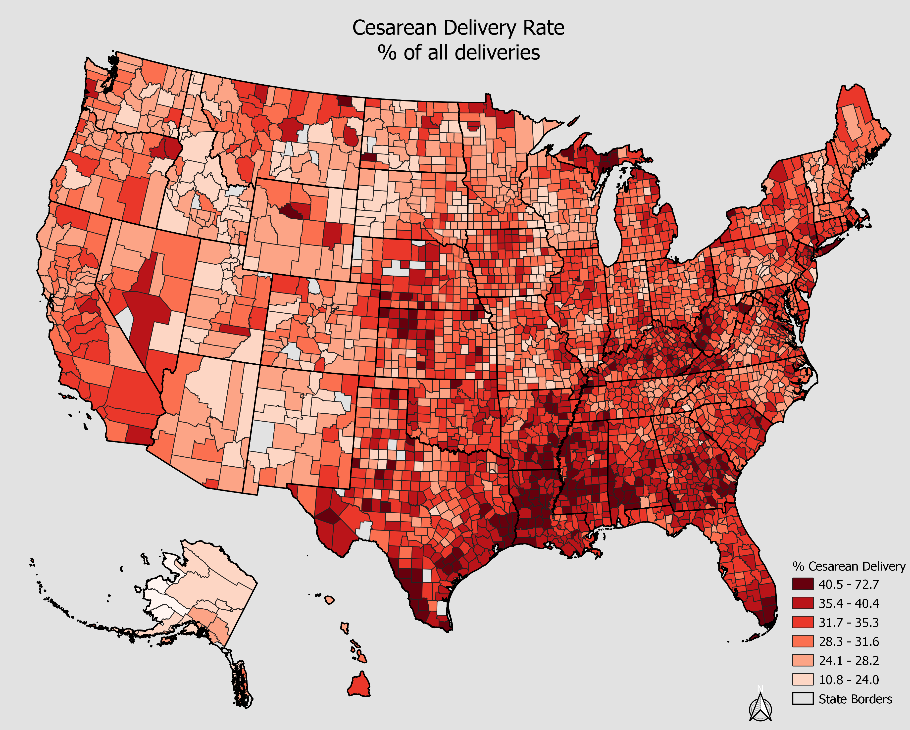
<pre>
    "NAME"          Name of State/County
    "PERCENT"       (%) of all live births that were cesarean deliveries
    "FIPS"          Federal Information Processing System Code
    "STATE"         Name of State
    "COUNTY"        Name of County
</pre>

Factor:&emsp;&emsp;&emsp;&emsp;&nbsp;<a name="12"/>[II-12](csv/II-12.csv)\
Source:&emsp;&emsp;&emsp;&emsp;(2017-2019) Health Resources & Services Administration (HRSA) Maternal & Child Health Bureau\
Description:&emsp;&emsp;Preterm birth rates; County Level\
Key Variable:&emsp;&ensp;&nbsp;Estimated (%) of live births that are preterm (/> 37 weeks)\
Points:&emsp;&emsp;&emsp;&emsp;&nbsp;Highest Quartile within US: 2pts; Second-Highest Quartile: 1pt

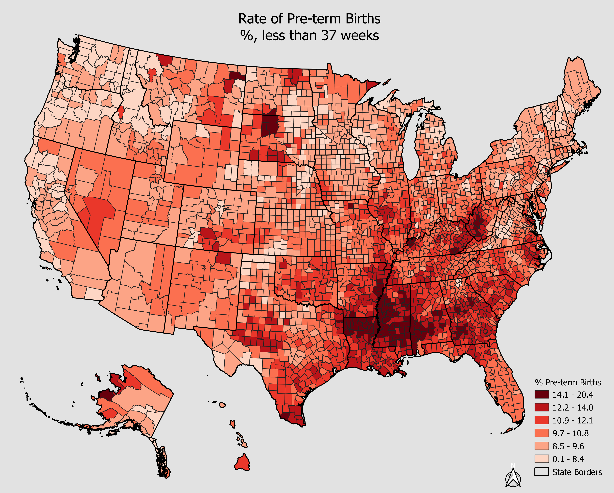
<pre>
    "REGION"        HRSA Region
    "STATE"         Name of State
    "COUNTY"        Name of County
    "PRETBRPCT"     Estimated (%) of live births that are preterm (/> 37 weeks)
    "FIPS"          Federal Information Processing System Code
</pre>

Factor:&emsp;&emsp;&emsp;&emsp;&nbsp;<a name="13"/>[III-13](csv/III-13.csv)\
Source:&emsp;&emsp;&emsp;&emsp;(2022) County Health Rankings & Roadmaps, University of Wisconsin Population Health Institute\
Description:&emsp;&emsp;Mental Healthcare Providers; County Level\
Key Variable:&emsp;&ensp;&nbsp;(#) of mental healthcare providers\
Points:&emsp;&emsp;&emsp;&emsp;&nbsp;Below median within US: 1pt

### Tier III (7 pts max)

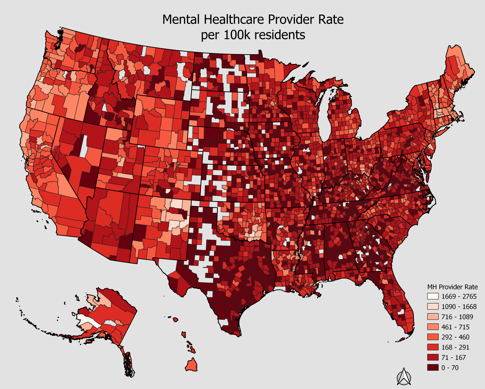
<pre>
    "FIPS"          Federal Information Processing System Code
    "STATE"         Name of State
    "COUNTY"        Name of County
    "MHP_NUMBER"    (#) of mental health providers
    "MHP_RATE"      Mental Health Providers per 100,000 population
    "MHP_RATIO"     Population to Mental Health Providers ratio
    "MHP_QRT"       Within-state rank: 1 = top quartile, 2=second quartile, 3= third quartile, 4=bottom quartile
</pre>

Factor:&emsp;&emsp;&emsp;&emsp;&nbsp;<a name="14"/>[III-14](csv/III-14.csv)\
Source:&emsp;&emsp;&emsp;&emsp;(2022) County Health Rankings & Roadmaps, University of Wisconsin Population Health Institute\
Description:&emsp;&emsp;Income Inequality; County Level\
Key Variable:&emsp;&ensp;&nbsp;Income Ratio (80th percentile/20th percentile)\
Points:&emsp;&emsp;&emsp;&emsp;&nbsp;Above median within US: 1pt

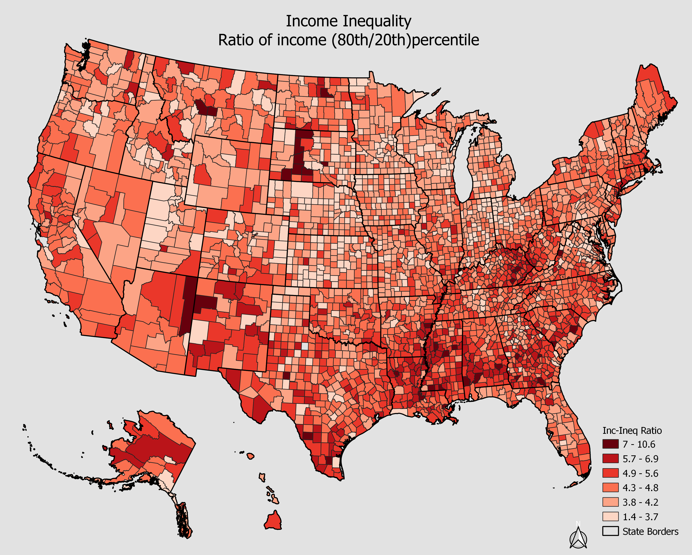
<pre>
    "FIPS"          Federal Information Processing System Code
    "STATE"         Name of State
    "COUNTY"        Name of County
    "MHP_NUMBER"    (#) of mental healthcare providers
    "MHP_RATE"      Mental Healthcare Providers per 100,000 population
    "MHP_RATIO"     Population to Mental Healthcare Providers ratio
    "MHP_QRT"       Within-state rank: 1 = top quartile, 2=second quartile, 3= third quartile, 4=bottom quartile
</pre>

Factor:&emsp;&emsp;&emsp;&emsp;&nbsp;<a name="15"/>[III-15](csv/III-15.csv)\
Source:&emsp;&emsp;&emsp;&emsp;(2019) CDC WONDER Single-Race Population Estimates\
Description:&emsp;&emsp;Reproductive Age, % white; County Level\
Key Variable:&emsp;&ensp;&nbsp;(%) of Women 15-44 Years of Age by Race - White\
Points:&emsp;&emsp;&emsp;&emsp;&ensp;Lowest Quartile within US: 2pts; Second-Lowest Quartile: 1pt

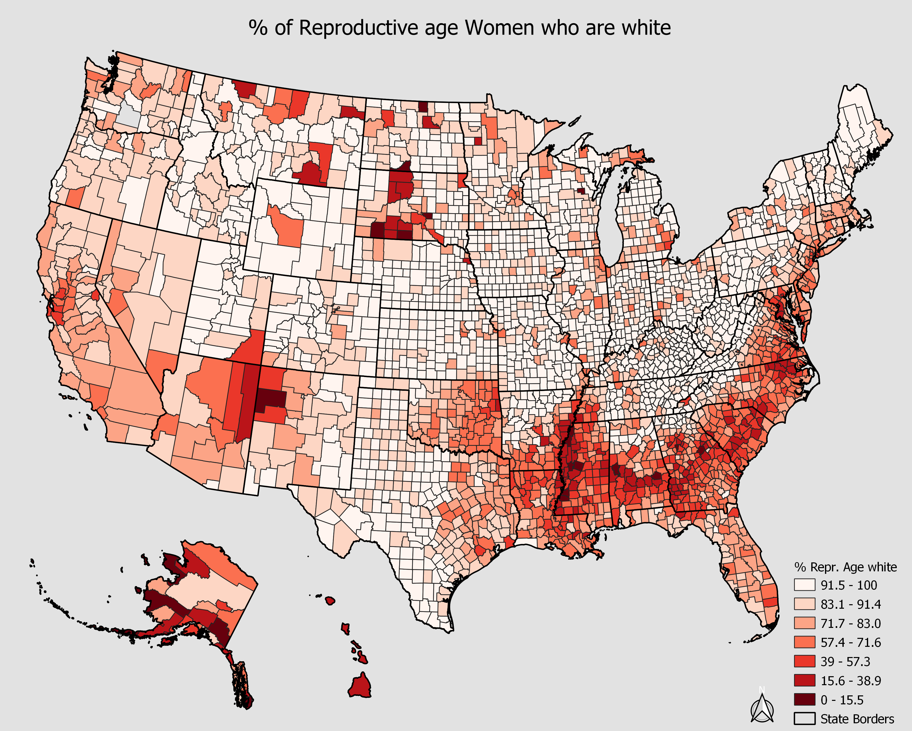
<pre>
    "REGION"        HRSA Region
    "STATE"         Name of State
    "COUNTY"        Name of County
    "NRPAWWH"       (#) of Women 15-44 Years of Age by Race - White
    "PCTRPAWWH"     (%) of Women 15-44 Years of Age by Race - White
    "FIPS"          Federal Information Processing System Code
</pre>

Factor:&emsp;&emsp;&emsp;&emsp;&nbsp;<a name="16"/>[III-16](csv/III-16.csv)\
Source:&emsp;&emsp;&emsp;&emsp;(2019) CDC WONDER Single-Race Population Estimates\
Description:&emsp;&emsp;Reproductive Age, % Hispanic; County Level\
Key Variable:&emsp;&ensp;&nbsp;(%) of Women 15-44 Years of Age by Ethnicity - Hispanic or Latina\
Points:&emsp;&emsp;&emsp;&emsp;&nbsp;Highest Quartile within US: 2pts; Highest-Lowest Quartile: 1pt

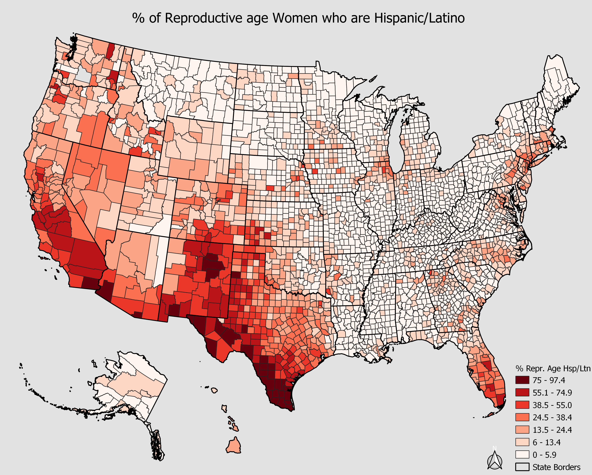
<pre>
    "REGION"        HRSA Region
    "STATE"         Name of State
    "COUNTY"        Name of County
    "NRPAWHSP"      (#) of Women 15-44 Years of Age by Ethnicity - Hispanic or Latina
    "PCTRPAWHSP"    (%) of Women 15-44 Years of Age by Ethnicity - Hispanic or Latina
    "FIPS"          Federal Information Processing System Code
</pre>

Factor:&emsp;&emsp;&emsp;&emsp;&nbsp;<a name="17"/>[III-17](csv/III-17.csv)\
Source:&emsp;&emsp;&emsp;&emsp;(2022) County Health Rankings & Roadmaps, University of Wisconsin Population Health Institute\
Description:&emsp;&emsp;Lack of insurance coverage; County Level\
Key Variable:&emsp;&ensp;&nbsp;(%) of Uninsured (adults)\
Points:&emsp;&emsp;&emsp;&emsp;&nbsp;Above median within US: 1pt

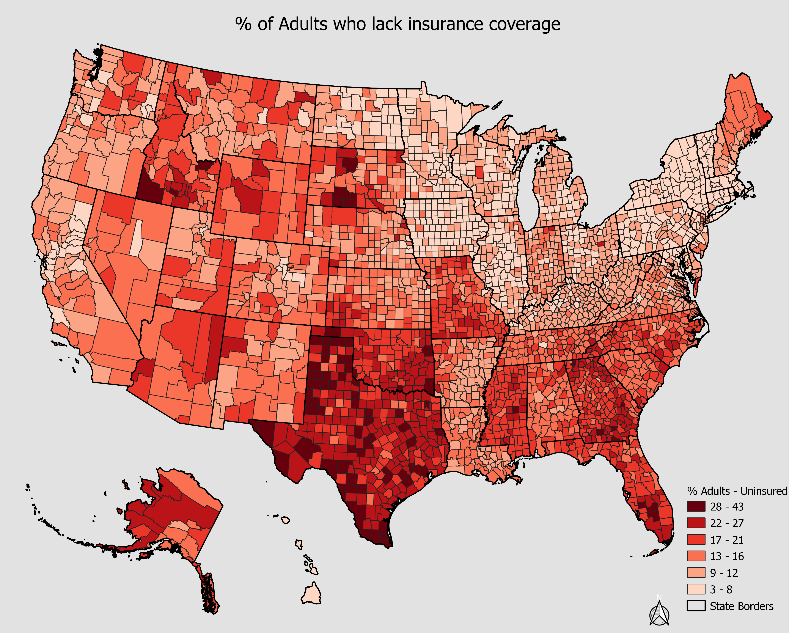
<pre>
    "FIPS"          Federal Information Processing System Code
    "STATE"         Name of State
    "COUNTY"        Name of County

    ***Uninsured (all)***
    "NUI"           (#) of Uninsured (all)
    "PCTUI"         (%) of Uninsured (all)
    "UI95CILB"      Lower Bound, 95% C.I.
    "UI95CIUB"      Upper Bound, 95% C.I.
    "UIQRT"         County Quartile within State

    ***Uninsured (adults)***
    "NUIAD"         (#) of Uninsured (adults)
    "PCTUIAD"       (%) of Uninsured (adults)
    "UIAD95CILB"    Lower Bound, 95% C.I.
    "UIAD95CIUB"    Upper Bound, 95% C.I.
</pre>

Factor:&emsp;&emsp;&emsp;&emsp;&nbsp;<a name="18"/>[III-18](csv/III-18.csv)\
Source:&emsp;&emsp;&emsp;&emsp;(2022) County Health Rankings & Roadmaps, University of Wisconsin Population Health Institute\
Description:&emsp;&emsp;Severe housing problems; County Level\
Key Variable:&emsp;&ensp;&nbsp;(%) with Severe Housing Problems\
Points:&emsp;&emsp;&emsp;&emsp;&nbsp;Above median within US: 1pt

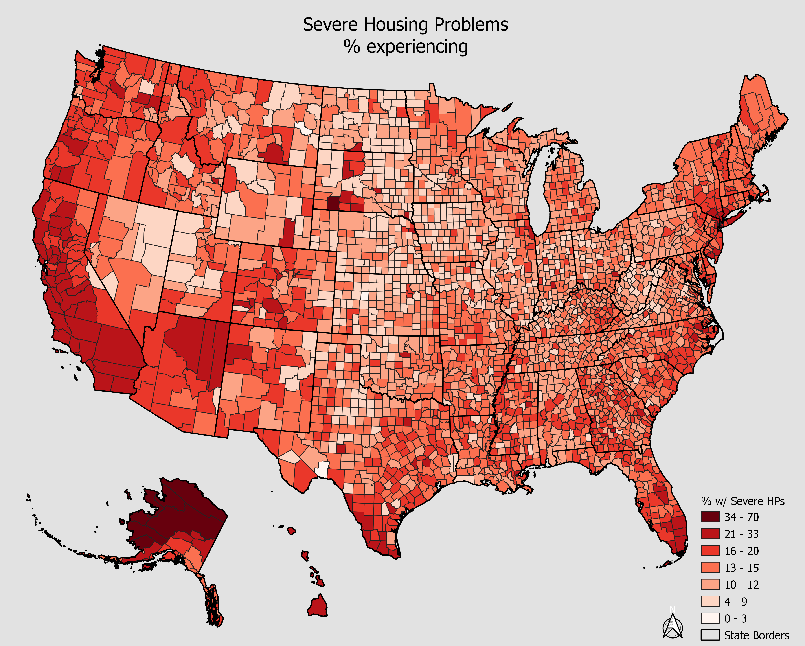
<pre>
    "FIPS"          Federal Information Processing System Code
    "STATE"         Name of State
    "COUNTY"        Name of County

    ***Severe Housing Problems***
    "PCTSHP"        (%) with Severe Housing Problems
    "SHP95CILB"     Lower Bound, 95% C.I.
    "SHP95CIUB"     Upper Bound, 95% C.I.

    ***Severe Housing Cost Burden***
    "SHCB"          (%) with Severe Housing Cost Burden
    "SHCB95CILB"    Lower Bound, 95% C.I.
    "SHCB95CIUB"    Upper Bound, 95% C.I.

    ***Overcrowding***
    "PCTOCRWD"      (%) with Overcrowding
    "OCRWD95CILB"   Lower Bound, 95% C.I.
    "OCRWD95CIUB"   Upper Bound, 95% C.I.

    ***Inadequate Facilities***
    "PCTIAF"        (%) with Inadequate Facilities
    "IAF95CILB"     Lower Bound, 95% C.I.
    "IAF95CIUB"     Upper Bound, 95% C.I.
    "IAFQRT" 
</pre>

Factor:&emsp;&emsp;&emsp;&emsp;&nbsp;<a name="19"/>[III-19](csv/III-19.csv)\
Source:&emsp;&emsp;&emsp;&emsp;(2022) County Health Rankings & Roadmaps, University of Wisconsin Population Health Institute\
Description:&emsp;&emsp;Food insecurity; County Level\
Key Variable:&emsp;&ensp;&nbsp;(%) with Food insecurity\
Points:&emsp;&emsp;&emsp;&emsp;&nbsp;Above median within US: 1pt

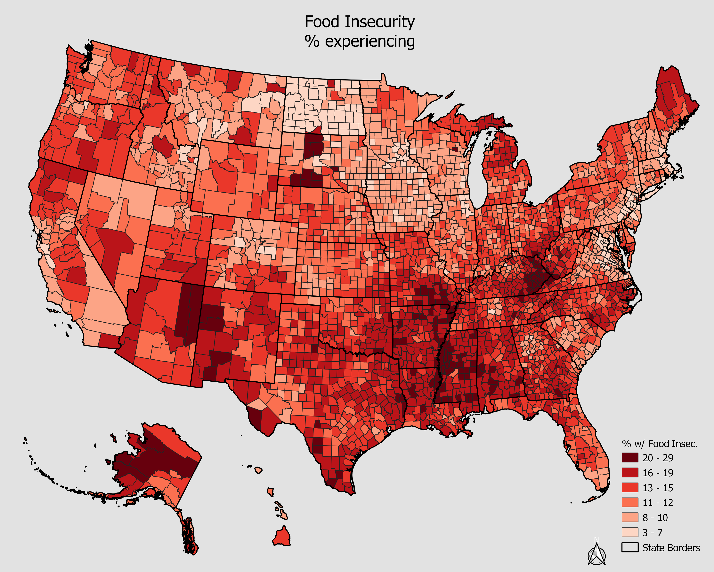
<pre>
    "FIPS"          Federal Information Processing System Code
    "STATE"         Name of State
    "COUNTY"        Name of County
    "FEIDX"         Food Environment Index
    "FEIDXQRT"      County Quartile within State
    "NFIS"          (#) with Food insecurity
    "PCTFIS"        (%) with Food insecurity 
    "NLIMA"         (#) with Limited access to healthy foods
    "PCTLIMA"       (%) with Limited access to healthy foods
</pre>

### Direct Measures of Need (8 pts max)
Factor:&emsp;&emsp;&emsp;&emsp;&nbsp;<a name="20"/>[DMN-20](csv/DMN-20.csv)\
Source:&emsp;&emsp;&emsp;&emsp;(2020-2021) National Survey of Children’s Health, Health Resources and Services Administration,\
&emsp;&emsp;&emsp;&emsp;&emsp;&emsp;&emsp; Maternal and Child Health Bureau\
Description:&emsp;&emsp;Poor mental health among mothers; State Level\
Key Variable:&emsp;&ensp;(%) with 'Fair or poor' status\
Points:&emsp;&emsp;&emsp;&emsp;&nbsp;Highest Quartile within US: 4pts; Second-Highest Quartile: 3pts

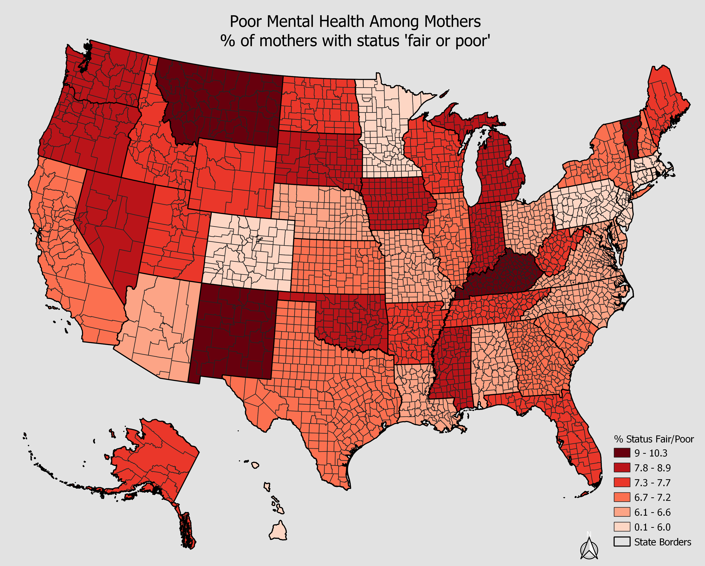
<pre>
Indicator 6.2: If this child’s mother is a primary caregiver and lives in the household, in general,
               what is the status of mother's mental and emotional health? 
    "STATE"         Name of State
    "STEXVG"        (%) with 'Excellent or very good' status
    "STGD"          (%) with 'Good' status
    "STFP"          (%) with 'Fair or poor' status
    "STTOT"         (%) total
</pre>

Factor:&emsp;&emsp;&emsp;&emsp;&nbsp;<a name="21"/>[DMN-21](csv/DMN-21.csv)\
Source:&emsp;&emsp;&emsp;&emsp;(2020-2021) National Survey of Children’s Health, Health Resources and Services Administration,\
&emsp;&emsp;&emsp;&emsp;&emsp;&emsp;&emsp; Maternal and Child Health Bureau\
Description:&emsp;&emsp;Mothers not coping well with raising their child; State Level\
Key Variable:&emsp;&ensp;&nbsp;(%) answering 'Very well'\
NOTES:&emsp;&emsp;&emsp;&ensp;Categories 2 & 3 are combined as a negative indicator\
&emsp;&emsp;&emsp;&emsp;&emsp;&emsp;&emsp;&nbsp;Scoring based on lowest % answering 'Very well'\
&emsp;&emsp;&emsp;&emsp;&emsp;&emsp;&emsp;&nbsp;48 states included, most recent year varies\
Points:&emsp;&emsp;&emsp;&emsp;&nbsp;Lowest Quartile within US: 4pts; Second-Lowest Quartile: 3pts

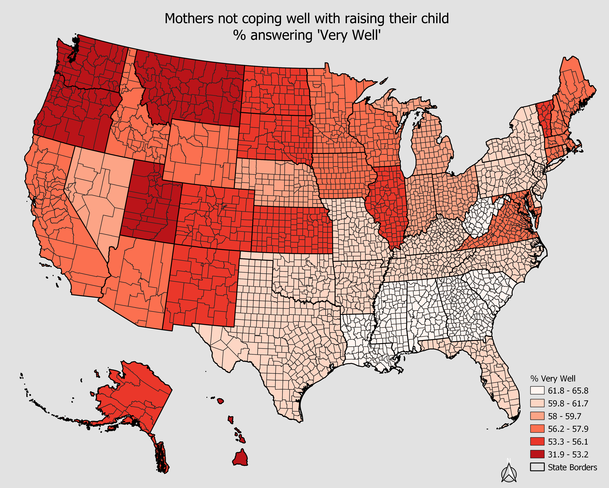
<pre>
Indicator 6.16: How well do you think you are handling the day-to-day demands of raising children? 
    "STATE"         Name of State
    "HD2DVW"        (%) answering 'Very well'
    "HD2DSW"        (%) answering 'Somewhat well, not very well or not very well at all'
    "HD2DNVW"       (%) answering 'Not very well or not very well at all'
    "HD2DTOT"       (%) total
</pre>

Factor:&emsp;&emsp;&emsp;&emsp;&nbsp;<a name="22"/>[DMN-22](csv/DMN-22.csv)\
Source:&emsp;&emsp;&emsp;&emsp;(2021) Centers for Disease Control and Prevention (CDC), National Center for Health Statistics\
&emsp;&emsp;&emsp;&emsp;&emsp;&emsp;&emsp; (NCHS), National Vital Statistics System\
Description:&emsp;&emsp;Births and birth rates; County Level\
Key Variable:&emsp;&ensp;&nbsp;(#) Births Divided by (#) Female aged 15-44 years\
NOTES:&emsp;&emsp;&emsp;&emsp;Dataset includes 576 counties w/ population above 100k; Counties with fewer than 100k are aggregated for each state under the name 'Unidentified Counties'\
Points:&emsp;&emsp;&emsp;&emsp;&nbsp;Highest Quartile within US: 2pts; Second-Highest Quartile: 1pt

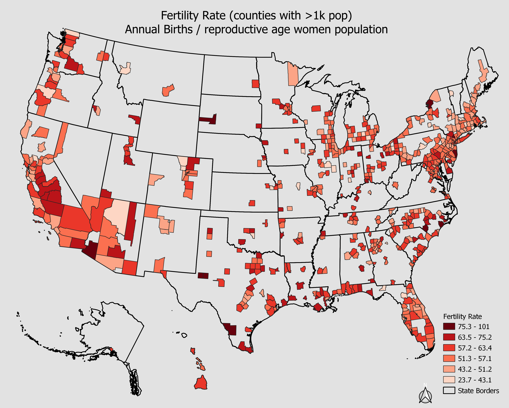
<pre>
    "COUNTY"        Name of County
    "STABRV"        State Abreviation
    "FIPS"          Federal Information Processing System Code
    "BIRTHS"        (#) of Births
    "TOTPOP"        Population, total
    "BIRTHRATE"     (#) Births Divided by Total Population
    "FEMPOP"        Female Population, total
    "RPRAFEM"       (#) Female aged 15-44 years
    "FERTRATE"      (#) Births Divided by (#) Female aged 15-44 years
    "BIRTHS"        CDC Estimate of Actual Births, 2021
</pre>

## Contributors

The Maternal Mental Health Risk Factors index was created by Caitlin Murphy, Rebecca Britt, and Joy Burkhard, with technical guidance provided by Adam Childers.

## References ##

[^1]: Based on a 2022 systematic review, PMS/PMDD, **violent
    experiences**, and unintended pregnancy had robust associations with
    PPD. Gastaldon, C., Solmi, M., Correll, C., Barbui, C., &
    Schoretsanitis, G. (2022). Risk factors of postpartum depression and
    depressive symptoms: Umbrella review of current evidence from
    systematic reviews and meta-analyses of observational studies. The
    British Journal of Psychiatry, 221(4), 591-602.
    doi:10.1192/bjp.2021.222

[^2]: A 2020 umbrella review found that the most common risk factors for
    PPD were high life stress, prenatal depression, lack of social
    support, **current or past abuse**, and partner dissatisfaction,
    with the two strongest being prenatal depression and current abuse.
    Hutchens, B. F., & Kearney, J. (2020). Risk Factors for Postpartum
    Depression: An Umbrella Review. *Journal of midwifery & women\'s
    health*, *65*(1), 96--108. https://doi.org/10.1111/jmwh.13067

[^3]: A 2020 systematic review of systematic reviews and meta-analyses
    found the following risk factors to be associated with PPD:
    **violence and abuse**, gestational diabetes, cesarean section,
    depressive history, vitamin D deficiency, postpartum sleep
    disruption and poor postpartum sleep, lack of social support,
    preterm and low-birth-weight infants, postpartum anemia, and
    negative birth experiences. Zhao, X. H., & Zhang, Z. H. (2020). Risk
    factors for postpartum depression: An evidence-based systematic
    review of systematic reviews and meta-analyses. *Asian journal of
    psychiatry*, *53*, 102353. https://doi.org/10.1016/j.ajp.2020.102353

[^4]: Based on a 2022 systematic review, PMS/PMDD, **violent
    experiences**, and unintended pregnancy had robust associations with
    PPD. Gastaldon, C., Solmi, M., Correll, C., Barbui, C., &
    Schoretsanitis, G. (2022). Risk factors of postpartum depression and
    depressive symptoms: Umbrella review of current evidence from
    systematic reviews and meta-analyses of observational studies. The
    British Journal of Psychiatry, 221(4), 591-602.
    doi:10.1192/bjp.2021.222

[^5]: A 2020 systematic review of systematic reviews and meta-analyses
    found the following risk factors to be associated with PPD:
    **violence and abuse**, gestational diabetes, cesarean section,
    depressive history, vitamin D deficiency, postpartum sleep
    disruption and poor postpartum sleep, lack of social support,
    preterm and low-birth-weight infants, postpartum anemia, and
    negative birth experiences. Zhao, X. H., & Zhang, Z. H. (2020). Risk
    factors for postpartum depression: An evidence-based systematic
    review of systematic reviews and meta-analyses. *Asian journal of
    psychiatry*, *53*, 102353. https://doi.org/10.1016/j.ajp.2020.102353

[^6]: A 2020 umbrella review found that the most common risk factors for
    PPD were **high life stress, prenatal depression**, lack of social
    support, current or past abuse, and partner dissatisfaction, with
    the two strongest being prenatal depression and current abuse.
    Hutchens, B. F., & Kearney, J. (2020). Risk Factors for Postpartum
    Depression: An Umbrella Review. *Journal of midwifery & women\'s
    health*, *65*(1), 96--108. https://doi.org/10.1111/jmwh.13067

[^7]: A 2020 systematic review of systematic reviews and meta-analyses
    found the following risk factors to be associated with PPD: violence
    and abuse, gestational diabetes, cesarean section, **depressive
    history,** vitamin D deficiency, postpartum sleep disruption and
    poor postpartum sleep, lack of social support, preterm and
    low-birth-weight infants, postpartum anemia, and negative birth
    experiences. Zhao, X. H., & Zhang, Z. H. (2020). Risk factors for
    postpartum depression: An evidence-based systematic review of
    systematic reviews and meta-analyses. *Asian journal of
    psychiatry*, *53*, 102353. https://doi.org/10.1016/j.ajp.2020.102353

[^8]: A 2020 umbrella review found that the most common risk factors for
    PPD were high life stress, prenatal depression**, lack of social
    support**, current or past abuse, and partner dissatisfaction, with
    the two strongest being prenatal depression and current abuse.
    Hutchens, B. F., & Kearney, J. (2020). Risk Factors for Postpartum
    Depression: An Umbrella Review. *Journal of midwifery & women\'s
    health*, *65*(1), 96--108. https://doi.org/10.1111/jmwh.13067

[^9]: A 2020 systematic review of systematic reviews and meta-analyses
    found the following risk factors to be associated with PPD: violence
    and abuse, gestational diabetes, cesarean section, depressive
    history, vitamin D deficiency, postpartum sleep disruption and poor
    postpartum sleep, **lack of social support,** preterm and
    low-birth-weight infants, postpartum anemia, and negative birth
    experiences. Zhao, X. H., & Zhang, Z. H. (2020). Risk factors for
    postpartum depression: An evidence-based systematic review of
    systematic reviews and meta-analyses. *Asian journal of
    psychiatry*, *53*, 102353. https://doi.org/10.1016/j.ajp.2020.102353

[^10]: Based on a 2022 systematic review, PMS/PMDD, violent experiences,
    and **unintended pregnancy** had robust associations with PPD.
    Gastaldon, C., Solmi, M., Correll, C., Barbui, C., & Schoretsanitis,
    G. (2022). Risk factors of postpartum depression and depressive
    symptoms: Umbrella review of current evidence from systematic
    reviews and meta-analyses of observational studies. The British
    Journal of Psychiatry, 221(4), 591-602. doi:10.1192/bjp.2021.222

[^11]: 2016 systematic review finding that women with unintended
    pregnancies are significantly more likely to develop PPD Abajobir,
    A. A., Maravilla, J. C., Alati, R., & Najman, J. M. (2016). A
    systematic review and meta-analysis of the association between
    unintended pregnancy and perinatal depression. *Journal of affective
    disorders*, *192*, 56--63. https://doi.org/10.1016/j.jad.2015.12.008

[^12]: 2020 systematic review finding that women with unintended
    pregnancies are significantly more likely to develop PPD: Qiu, X.,
    Zhang, S., Sun, X., Li, H., & Wang, D. (2020). Unintended pregnancy
    and postpartum depression: A meta-analysis of cohort and
    case-control studies. *Journal of psychosomatic research*, *138*,
    110259. https://doi.org/10.1016/j.jpsychores.2020.110259

[^13]: Based on Goyal 2010, women having four key socioeconomic risk
    factors (**low-income**, no college education, single mother,
    unemployed) were 11x more likely than women with no SES risk factors
    to have a clinically elevated depression score at 3 months
    postpartum, even after controlling for prenatal depressive symptoms.
    *(Goyal, Gay, Lee. (2010). How much does socioeconomic status
    increase the risk of prenatal and postpartum depressive symptoms.
    Women\'s Health Issues. 20(2): 96--104.
    doi:10.1016/j.whi.2009.11.003*

[^14]: A 2018 systematic review showing that **economic factors and
    income inequality** are major contributories to PPD prevalence.
    Hahn-Holbrook, J., Cornwell-Hinrichs, T., & Anaya, I. (2018).
    Economic and Health Predictors of National Postpartum Depression
    Prevalence: A Systematic Review, Meta-analysis, and Meta-Regression
    of 291 Studies from 56 Countries. *Frontiers in psychiatry*, *8*,
    248. https://doi.org/10.3389/fpsyt.2017.00248

[^15]: Based on Goyal 2010, women having four key socioeconomic risk
    factors (low-income, **no college education**, single mother,
    unemployed) were 11x more likely than women with no SES risk factors
    to have a clinically elevated depression score at 3 months
    postpartum, even after controlling for prenatal depressive symptoms.
    *(Goyal, Gay, Lee. (2010). How much does socioeconomic status
    increase the risk of prenatal and postpartum depressive symptoms.
    Women\'s Health Issues. 20(2): 96--104.
    doi:10.1016/j.whi.2009.11.003*

[^16]: Based on Goyal 2010, women having four key socioeconomic risk
    factors (low-income, no college education**, single mother**,
    unemployed) were 11x more likely than women with no SES risk factors
    to have a clinically elevated depression score at 3 months
    postpartum, even after controlling for prenatal depressive symptoms.
    *(Goyal, Gay, Lee. (2010). How much does socioeconomic status
    increase the risk of prenatal and postpartum depressive symptoms.
    Women\'s Health Issues. 20(2): 96--104.
    doi:10.1016/j.whi.2009.11.003*

[^17]: Based on Goyal 2010, women having four key socioeconomic risk
    factors (low-income, no college education, single mother,
    **unemployed**) were 11x more likely than women with no SES risk
    factors to have a clinically elevated depression score at 3 months
    postpartum, even after controlling for prenatal depressive symptoms.
    *(Goyal, Gay, Lee. (2010). How much does socioeconomic status
    increase the risk of prenatal and postpartum depressive symptoms.
    Women\'s Health Issues. 20(2): 96--104.
    doi:10.1016/j.whi.2009.11.003*

[^18]: 2006 article showing a high rate of depressive symptoms among
    teen mothers: Schmidt, R. M., Wiemann, C. M., Rickert, V. I., &
    Smith, E. O. (2006). Moderate to severe depressive symptoms among
    adolescent mothers followed four years postpartum. *The Journal of
    adolescent health : official publication of the Society for
    Adolescent Medicine*, *38*(6), 712--718.
    https://doi.org/10.1016/j.jadohealth.2005.05.023

[^19]: A 2020 systematic review of systematic reviews and meta-analyses
    found the following risk factors to be associated with PPD: violence
    and abuse, gestational diabetes, **cesarean section,** depressive
    history, vitamin D deficiency, postpartum sleep disruption and poor
    postpartum sleep, lack of social support, preterm and
    low-birth-weight infants, postpartum anemia, and negative birth
    experiences. Zhao, X. H., & Zhang, Z. H. (2020). Risk factors for
    postpartum depression: An evidence-based systematic review of
    systematic reviews and meta-analyses. *Asian journal of
    psychiatry*, *53*, 102353. https://doi.org/10.1016/j.ajp.2020.102353

[^20]: A 2020 systematic review of systematic reviews and meta-analyses
    found the following risk factors to be associated with PPD: violence
    and abuse, gestational diabetes, cesarean section, depressive
    history, vitamin D deficiency, postpartum sleep disruption and poor
    postpartum sleep, lack of social support, **preterm and
    low-birth-weight infants**, postpartum anemia, and negative birth
    experiences. Zhao, X. H., & Zhang, Z. H. (2020). Risk factors for
    postpartum depression: An evidence-based systematic review of
    systematic reviews and meta-analyses. *Asian journal of
    psychiatry*, *53*, 102353. https://doi.org/10.1016/j.ajp.2020.102353

[^21]: National Vital Statistics System Rapid Release Quarterly
    Provisional Estimates. Births: Provisional Data for 2022. https://www.cdc.gov/nchs/data/vsrr/vsrr028.pdf
